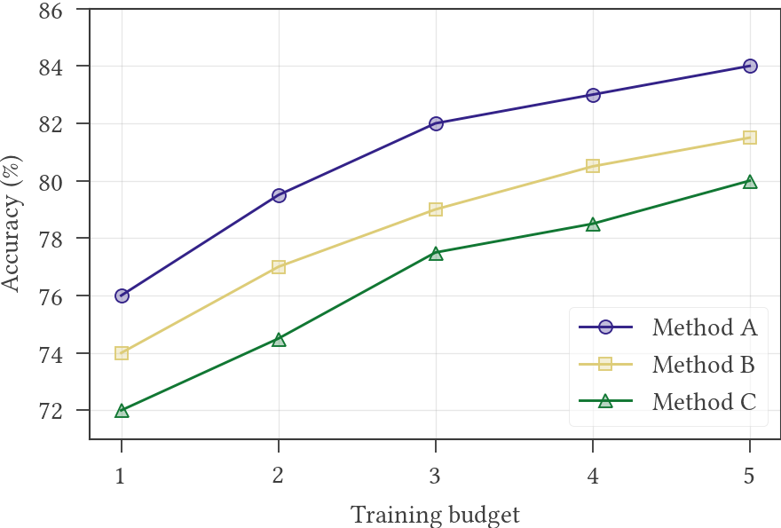
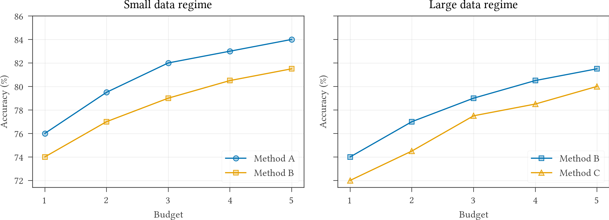
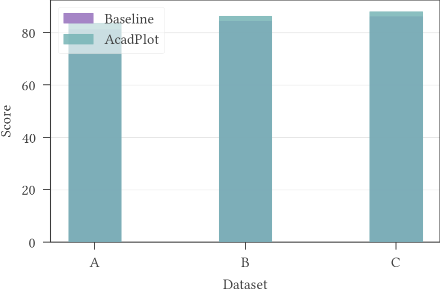
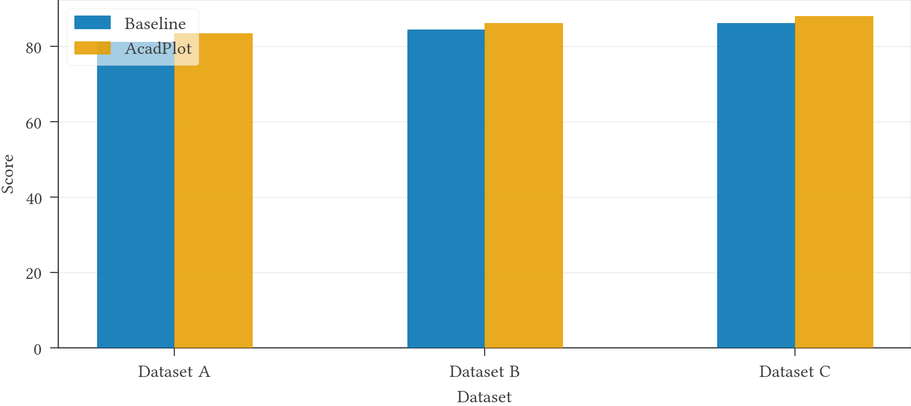
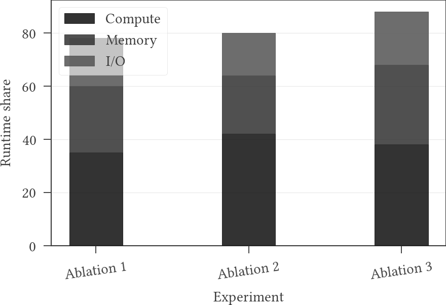
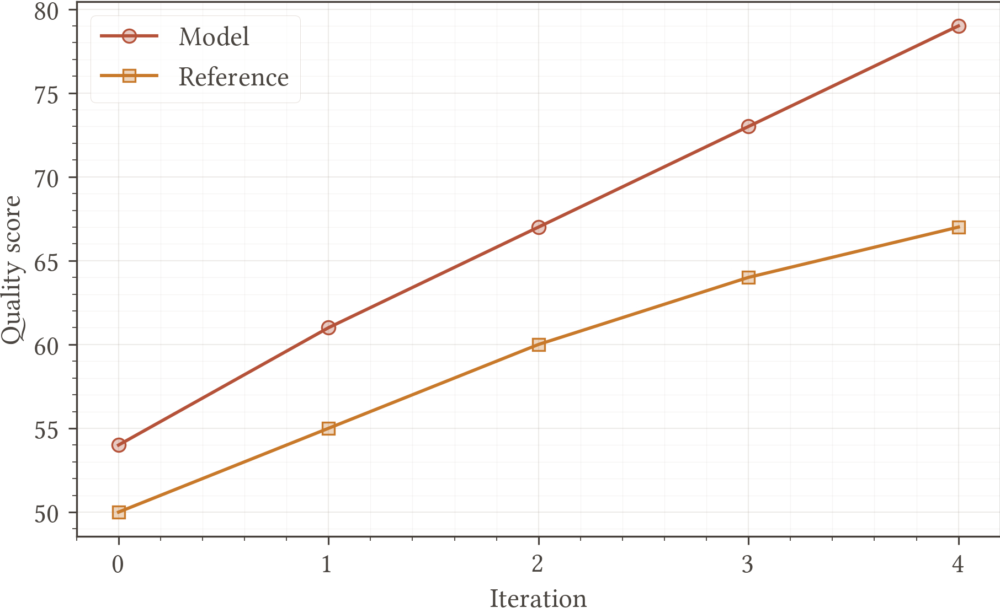
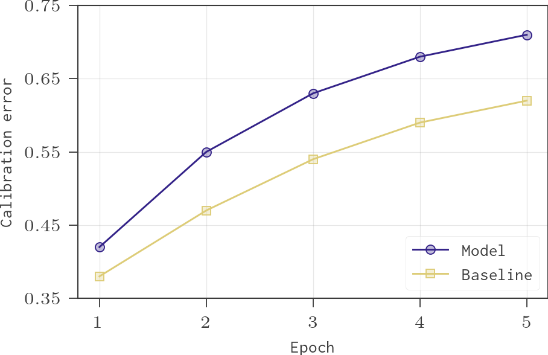
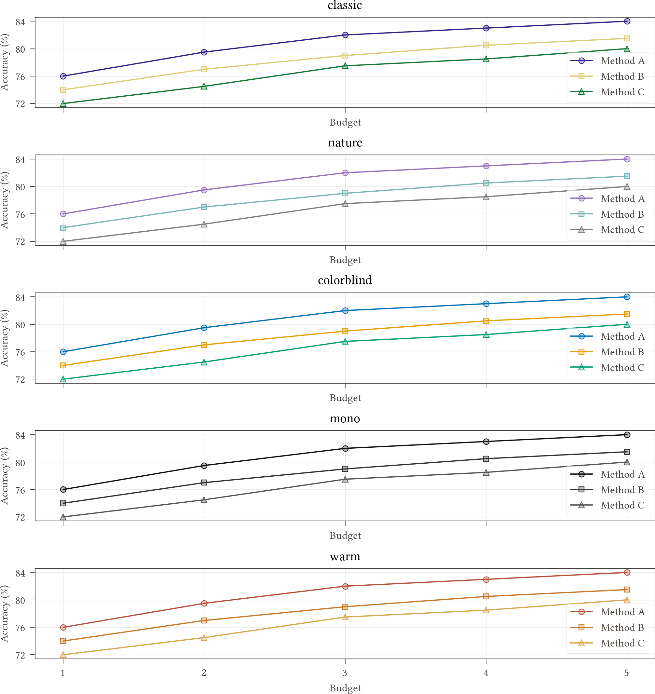

# AcadPlot

A simple plotting tool using matplotlib for generating publication-quality plots and subplots for research papers.

AcadPlot defaults to an academic Libertine-style setup with LaTeX rendering when available.

## Examples

Regenerate every example from source with:

```bash
uv run python examples/generate_examples.py
```

The committed examples use LaTeX Libertine; regeneration requires a TeX installation with the `libertine` and `newtx` packages.

### Core Figures





### Bar Figures







### Style Coverage

The examples cover all built-in themes and layout profiles:

- `classic` with `paper-1col`: line plot
- `classic` with `paper-1col` and `inconsolata`: monospace line plot
- `nature` with `paper-1col`: bar plot
- `colorblind` with `paper-2col`: subplot and grouped bar plots
- `mono` with `paper-1col`: stacked bar plot
- `warm` with `presentation`: presentation-scale line plot








## Features

- 📊 Easy-to-use API for creating academic plots
- 🎨 Pre-defined color schemes optimized for academic publications
- 🖋️ Theme-controlled axis, tick, and legend colors for consistent figures
- 🔷 Multiple marker styles for distinguishing data series
- 📐 LaTeX support for mathematical notation
- 🔧 Customizable plot elements (ticks, grids, legends)
- 📑 Support for both single plots and subplots

## Installation

### From GitHub

```bash
pip install git+https://github.com/sudip-bhujel/acadplot.git
```

or with `uv`:

```bash
uv add git+https://github.com/sudip-bhujel/acadplot.git
```

### Local Installation (Development)

For local development, clone the repository and install in editable mode:

```bash
git clone https://github.com/sudip-bhujel/acadplot.git
cd acadplot
pip install -e .
```

## Requirements

- Python >= 3.14
- matplotlib >= 3.10.8

## Usage

### Global Publication Style

Declare the figure style once near the top of your script, then call plotting functions normally:

```python
from acadplot import configure_plot_style

configure_plot_style(layout="paper-1col", theme="classic", font="libertine")
```

Use `font="inconsolata"` for a polished monospace academic style:

```python
configure_plot_style(layout="paper-1col", theme="classic", font="inconsolata")
```

Available layouts:

```python
from acadplot import available_layouts

print(available_layouts())
# ("paper-1col", "paper-2col", "presentation")
```

Available professional themes:

```python
from acadplot import available_themes

print(available_themes())
# ("classic", "nature", "colorblind", "mono", "warm")
```

The default `classic` cycle uses a muted publication palette inspired by Paul
Tol's qualitative color schemes, so omitted colors are less saturated than
Matplotlib defaults while remaining distinct on screen and paper. Use
`theme="colorblind"` for an Okabe-Ito style accessible palette.

Use a temporary style override when needed:

```python
from acadplot import use_style

with use_style(layout="paper-2col", theme="colorblind"):
    plot_line(data, location="upper left", fname="wide_plot.pdf")
```

### Basic Plot

```python
from acadplot import plot_line, configure_plot_style

configure_plot_style(layout="paper-1col", theme="classic", font="libertine")

# Define your data: (x_values, y_values, marker, label)
# Colors are optional; omitted colors use the active professional theme palette.
data = [
    ([10, 20, 30, 40, 50], [5, 10, 15, 20, 25], "x_filled", "Method A"),
    ([10, 20, 30, 40, 50], [6, 11, 14, 18, 22], "square", "Method B"),
    ([10, 20, 30, 40, 50], [7, 9, 13, 19, 24], "triangle_up", "Method C"),
]

# Create the plot
plot_line(
    data,
    location="upper left",
    label=("X-axis Label", "Y-axis Label"),
    grid="major",
    ystart=0,
    yticks=range(0, 30, 5),
    fname="output.pdf"
)
```

### Custom Figure Size

```python
from acadplot import plot_line, configure_plot_style

configure_plot_style()

data = [
    ([10, 20, 30, 40, 50], [5, 10, 15, 20, 25], "x_filled", "Method A"),
    ([10, 20, 30, 40, 50], [6, 11, 14, 18, 22], "square", "Method B"),
]

# Create a larger plot
plot_line(
    data,
    location="upper left",
    fig_size=(5, 3),  # Custom figure size (width, height)
    label=("X-axis Label", "Y-axis Label"),
    fname="large_plot.pdf"
)
```

### Creating Subplots

```python
import matplotlib.pyplot as plt
from acadplot import plot_line, configure_plot_style

configure_plot_style()

data = [
    ([10, 20, 30, 40, 50], [5, 10, 15, 20, 25], "x_filled", "Method A"),
    ([10, 20, 30, 40, 50], [6, 11, 14, 18, 22], "square", "Method B"),
    ([10, 20, 30, 40, 50], [7, 9, 13, 19, 24], "triangle_up", "Method C"),
]

# Create figure with subplots
fig, axes = plt.subplots(1, 2, figsize=(6, 2))

# Plot on each subplot
plot_line(data, "upper left", ax=axes[0], fname=None)
plot_line(data, "upper right", ax=axes[1], fname=None)

# Adjust layout and save
plt.tight_layout(pad=0.2)
plt.subplots_adjust(wspace=0.27)
plt.savefig("subplots.pdf", bbox_inches="tight", pad_inches=0)
```

### Subplots with Shared Legend

```python
import matplotlib.pyplot as plt
from acadplot import plot_line, configure_plot_style

configure_plot_style()

data = [
    ([10, 20, 30, 40, 50], [5, 10, 15, 20, 25], "x_filled", "Method A"),
    ([10, 20, 30, 40, 50], [6, 11, 14, 18, 22], "square", "Method B"),
    ([10, 20, 30, 40, 50], [7, 9, 13, 19, 24], "triangle_up", "Method C"),
]

fig, axes = plt.subplots(1, 2, figsize=(6, 2))

# Plot on each subplot
plot_line(data, "upper left", ax=axes[0], fname=None)
plot_line(data, "upper right", ax=axes[1], fname=None)

# Remove individual legends
axes[0].get_legend().remove()
axes[1].get_legend().remove()

# Get handles and labels from one subplot
handles, labels = axes[0].get_legend_handles_labels()

# Create a single legend at the bottom center
fig.legend(
    handles,
    labels,
    loc="lower center",
    bbox_to_anchor=(0.5, -0.1),
    prop=dict(size=6, family="DejaVu Serif"),
    framealpha=0.6,
    columnspacing=0.5,
    ncols=3,
)

plt.tight_layout(pad=0.2)
plt.subplots_adjust(wspace=0.27)
plt.savefig("subplots_shared_legend.pdf", bbox_inches="tight", pad_inches=0)
```

## Bar Plots

Use the bar plotting functions to create single, grouped, or stacked bar charts.

### Single Bar Plot

```python
from acadplot import plot_bar, configure_plot_style

configure_plot_style()

data = [
    ([0, 1, 2], [5, 7, 6], "Method A"),
    ([0, 1, 2], [3, 6, 5], "Method B"),
]

plot_bar(
    data,
    location="upper left",
    label=("X-axis Label", "Y-axis Label"),
    xticklabels=["Group A", "Group B", "Group C"],
    fname="single_bar.pdf"
)
```

### Grouped Bar Plot

```python
from acadplot import plot_grouped_bar, configure_plot_style

configure_plot_style()

grouped_data = [
    ("Dataset A", [(10, "Train"), (8, "Val")]),
    ("Dataset B", [(15, "Train"), (12, "Val")]),
    ("Dataset C", [(12, "Train"), (14, "Val")]),
]

plot_grouped_bar(
    grouped_data,
    location="upper left",
    label=("X-axis Label", "Y-axis Label"),
    fname="grouped_bar.pdf"
)
```

### Stacked Bar Plot

```python
from acadplot import plot_stacked_bar, configure_plot_style

configure_plot_style()

categories = ["Dataset A", "Dataset B", "Dataset C"]
stacks = [
    ([10, 20, 15], "Method A"),
    ([5, 10, 8], "Method B"),
    ([3, 5, 4], "Method C"),
]

plot_stacked_bar(
    categories,
    stacks,
    location="upper left",
    label=("X-axis Label", "Y-axis Label"),
    fname="stacked_bar.pdf"
)
```

Omit colors to use the active theme palette. When needed, pass a color name,
index, hex code, or any Matplotlib color:

```python
explicit_data = [
    ([1, 2, 3], [4, 5, 6], "blue", "circle", "Named color"),
    ([1, 2, 3], [3, 4, 5], "#5F8A8B", "square", "Raw color"),
]
```

Available color names or indices (0-19):

```python
colors = {
    "blue", "orange", "green", "purple", "brown", "yellow",
    "sky_blue", "gray", "red", "pink", "teal", "olive",
    "navy", "maroon", "lime", "cyan", "magenta",
    "dark_gray", "light_gray"
}
```

## Available Markers

Use marker names or indices (0-26):

```python
markers = {
    "square", "triangle_up", "pentagon", "circle", "star",
    "plus_filled", "triangle_down", "diamond", "x_filled",
    "triangle_left", "triangle_right", "thin_diamond",
    "hexagon1", "hexagon2", "plus", "x", "vline", "hline",
    "point", "pixel", "tri_down", "tri_up", "tri_left",
    "tri_right", "octagon", "none"
}
```

## API Reference

### `plot_line(lines, location, fig_size, label, ax, xticks, yticks, xstart, ystart, font_size, grid, fname)`

**Parameters:**

- `lines` (List[Tuple]): List of lines to plot, each defined by `(x_values, y_values, marker, label)` or `(x_values, y_values, color, marker, label)`
- `location` (str): Location of the legend (e.g., "upper left", "lower right")
- `fig_size` (Tuple[float, float]): Figure size (width, height) in inches. Defaults to the active layout profile
- `label` (Tuple[str, str]): Labels for x and y axes. Default: `("x-label", "y-label")`
- `ax` (Optional[plt.Axes]): Axes to plot on. Creates new if None
- `xticks` (Optional[List[float] | range]): Custom x-axis ticks
- `yticks` (Optional[List[float] | range]): Custom y-axis ticks
- `xstart` (Optional[float]): Minimum x-axis value
- `ystart` (Optional[float]): Minimum y-axis value
- `font_size` (int): Font size for the plot. Defaults to the active layout profile
- `grid` (str): Grid preset: `"major-y"`, `"major"`, `"major-minor"`, or `"none"`
- `fname` (Optional[str]): Filename to save the plot. Default: `"plot.pdf"`

### `draw(ax, x, y, color_key, marker_key, label)`

Draw a single line with markers on the given axes.

### `configure_plot_style(layout, theme, font, latex)`

Configure global plot style settings with LaTeX rendering. Layouts and themes are composable:

```python
configure_plot_style(layout="paper-2col", theme="nature", font="libertine", latex=True)
```

Helper APIs:

- `available_layouts()`: Return supported layout profile names
- `available_themes()`: Return supported theme names
- `get_current_style()`: Return the active style settings
- `use_style(...)`: Temporarily apply a style inside a `with` block

### Utility Functions

- `new_alpha(color, alpha)`: Create new color with specified alpha
- `blend_color(rgba1, rgba2)`: Blend two RGBA colors
- `colors`: Dictionary of pre-defined color names and hex values
- `markers`: Dictionary of marker names and their matplotlib properties

## License

MIT License - see the [LICENSE](LICENSE) file for details.

## Contributing

Contributions are welcome! Please feel free to submit a Pull Request.

## Author

Sudip Bhujel
