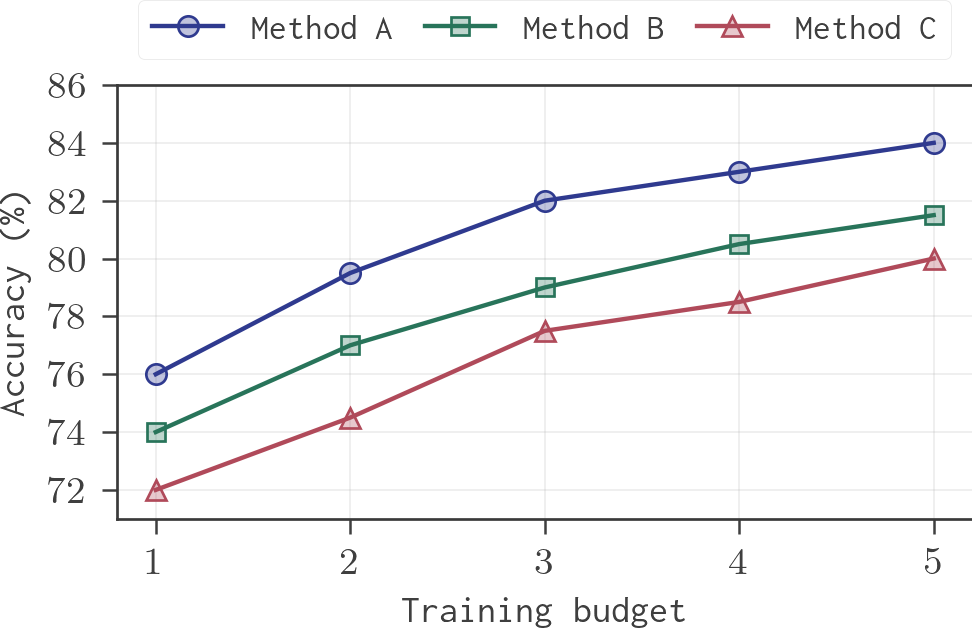
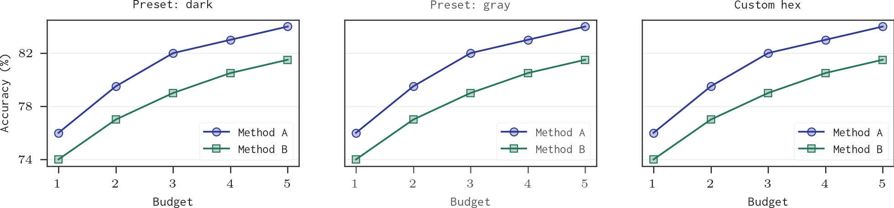
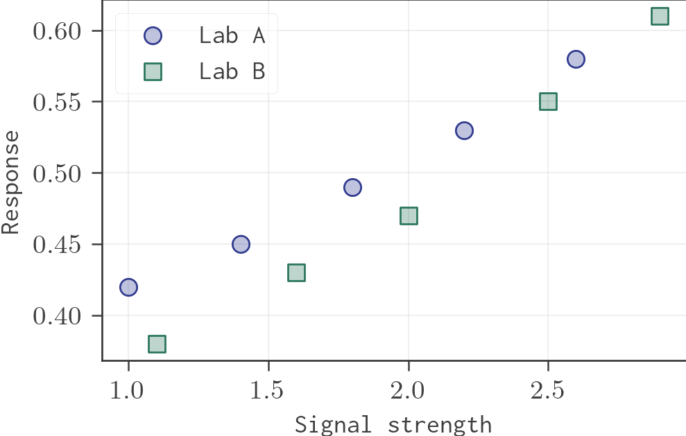
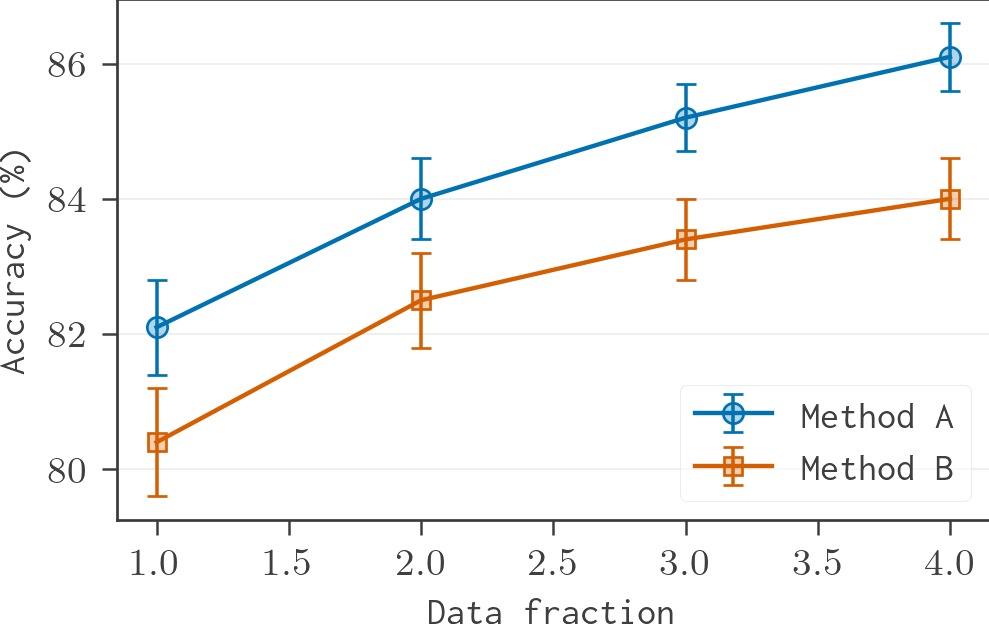
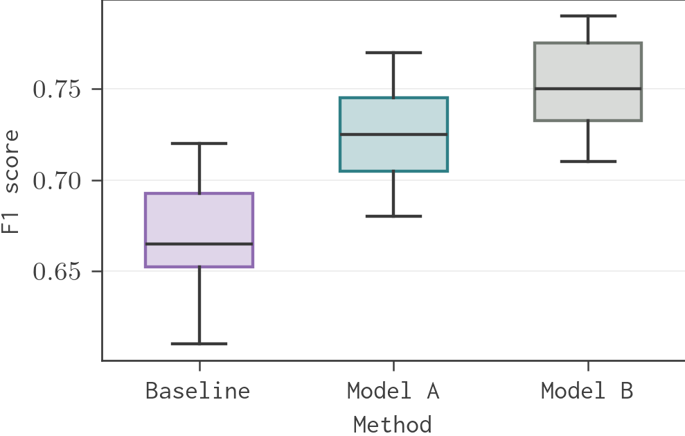
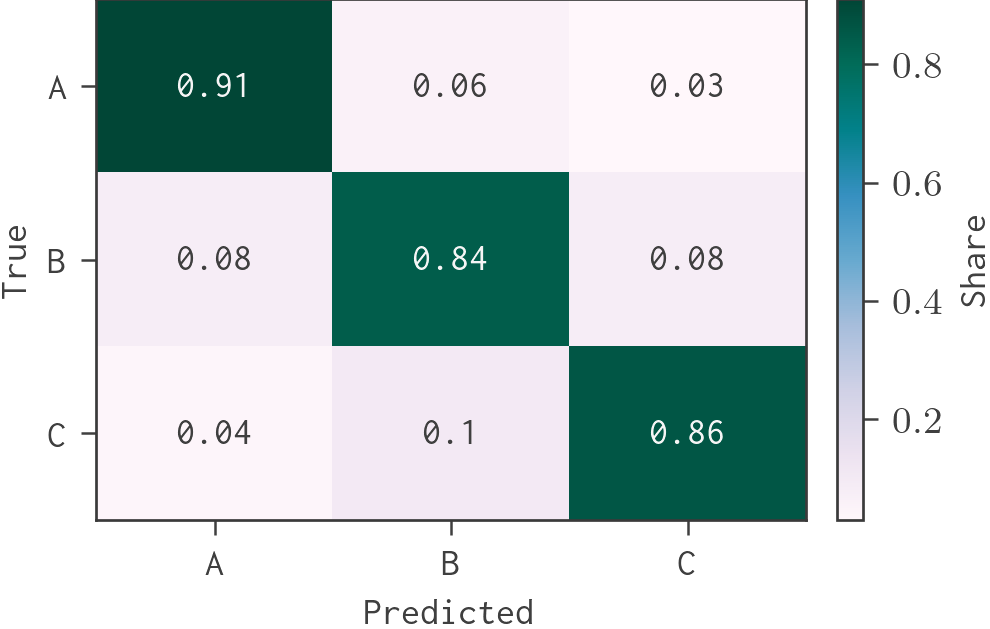
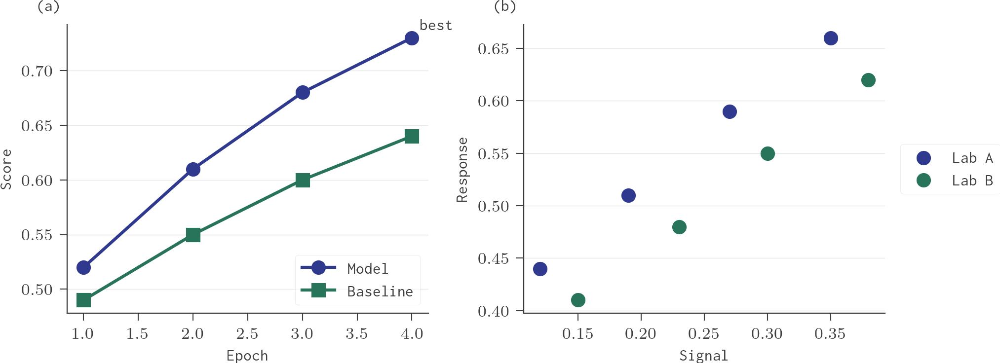

# AcadPlot

A simple plotting tool using matplotlib for generating publication-quality plots and subplots for research papers.

AcadPlot defaults to an academic Inconsolata-style setup with LaTeX rendering when available.

## Examples

Regenerate every example from source with:

```bash
uv run python examples/generate_examples.py
```

The committed examples use LaTeX Inconsolata; regeneration requires a TeX installation with the `zi4` package.

### Core Figures






### Bar Figures


### Additional Academic Figures











### Style Coverage

The examples cover all built-in themes and layout profiles:

- `classic` with `paper-1col`: line plot
- `classic` with `paper-2col`: compact monospace line plot
- `nature` with `paper-1col`: bar plot
- `colorblind` with `paper-2col`: grouped bar plot for one column in a two-column paper
- `colorblind` with `paper-2col-subplot`: two small subplots inside one column of a two-column paper
- `mono` with `paper-1col`: stacked bar plot
- `warm` with `presentation`: presentation-scale line plot


## Features

- 📊 Easy-to-use API for creating academic plots
- 🎨 Pre-defined color schemes optimized for academic publications
- 🖋️ Theme-controlled axis, tick, and legend colors for consistent figures
- 🔷 Multiple marker styles for distinguishing data series
- 📐 LaTeX support for mathematical notation
- 🔧 Customizable plot elements (ticks, grids, legends)
- 📈 Line, bar, scatter, error-bar, box, and heatmap chart helpers
- 💾 Publication-safe `save()` utility for PNG, PDF, and SVG output
- 📑 Support for both single plots and subplots

## Installation

### From GitHub

```bash
pip install git+https://github.com/sudip-bhujel/acadplot.git
```

or with `uv`:

```bash
uv add git+https://github.com/sudip-bhujel/acadplot.git
```

### Local Installation (Development)

For local development, clone the repository and install in editable mode:

```bash
git clone https://github.com/sudip-bhujel/acadplot.git
cd acadplot
pip install -e .
```

## Requirements

- Python >= 3.14
- matplotlib >= 3.10.8

## Usage

### Global Publication Style

Declare the figure style once near the top of your script, then call plotting functions normally:

```python
from acadplot import configure_plot_style

configure_plot_style(layout="paper-1col", theme="classic")
```

Override the layout font size when a paper template or reviewer copy needs it:

```python
configure_plot_style(
    layout="paper-2col",
    theme="classic",
    font_size=10.5,
)
```

Use separate font sizes when labels, ticks, legends, or titles need different treatment:

```python
configure_plot_style(
    layout="paper-2col",
    label_size=10.5,
    tick_size=8.5,
    legend_size=8.5,
    title_size=11,
)
```

Use one text-color knob when the default text is too light for a paper or
projector:

```python
configure_plot_style(
    layout="paper-2col",
    theme="classic",
    text_color="dark",
)
```

`text_color` applies to axis labels, tick labels, legend text, titles, and
AcadPlot annotations. Built-in text presets are separate from the data-series
color names:

```python
from acadplot import available_text_colors

print(available_text_colors())
# ("theme", "default", "dark", "black", "charcoal", "slate", "gray", "dimgray", "muted", "soft", "light")
```

You can also pass any Matplotlib-compatible color:

```python
configure_plot_style(text_color="#202020")
configure_plot_style(text_color="tab:blue")
configure_plot_style(text_color=(0.1, 0.2, 0.3))
```

Example with a built-in preset:

```python
from acadplot import configure_plot_style, plot_line

configure_plot_style(
    layout="paper-2col",
    theme="classic",
    text_color="dark",
)

plot_line(
    data,
    "lower right",
    label=("Budget", "Accuracy (%)"),
    fname="dark_text_plot.pdf",
)
```

Example with a custom hex color:

```python
configure_plot_style(text_color="#202020")
```

Scale an entire style when the figure needs to be uniformly stronger:

```python
configure_plot_style(layout="paper-2col", scale=1.1)
```

Layout meaning:

- `paper-1col`: full-width figure for a single-column paper.
- `paper-2col`: one-column figure inside a two-column paper; narrower, with the largest paper font and heavier marks because it is visually reduced on the page.
- `paper-2col-subplot`: two compact panels inside one column of a two-column paper; same width as `paper-2col`, with smaller fonts and lighter marks to avoid crowding.
- `paper-2col-span`: figure spanning both columns in a two-column paper.
- `presentation`: larger screen/projector figures.

Layout defaults:

| Layout | Figure size | Font defaults | Use when |
|---|---:|---:|---|
| `paper-1col` | `5.5 x 3.2 in` | balanced paper text | single-column paper figure |
| `paper-2col` | `3.35 x 2.15 in` | larger text and marks | one plot in one column of a two-column paper |
| `paper-2col-subplot` | `3.35 x 1.45 in` | smaller ticks/legend, compact marks | two small panels inside one column of a two-column paper |
| `paper-2col-span` | `6.8 x 2.8 in` | medium paper text | figure spanning both columns |
| `presentation` | `7.2 x 4.2 in` | large labels and heavier marks | slides and talks |

`paper-2col-subplot` intentionally uses smaller tick labels than axis labels:
`tick_size=4.8`, `legend_size=5.0`, `label_size=5.8`, and `title_size=5.8`.
This keeps dense two-panel figures legible without letting x/y tick labels
dominate the plot area.

Use `font="libertine"` when a serif academic style is preferred:

```python
configure_plot_style(layout="paper-2col", theme="classic", font="libertine")
```

For two subplots inside one column of a two-column paper, let the layout drive
the figure size:

```python
import matplotlib.pyplot as plt
from acadplot import configure_plot_style, figure_size, plot_line, save

configure_plot_style(layout="paper-2col-subplot", theme="colorblind")
fig, axes = plt.subplots(
    1,
    2,
    figsize=figure_size(),
    sharey=True,
    gridspec_kw={"wspace": 0.18},
)

plot_line(data_a, "lower right", ax=axes[0], fname=None)
plot_line(data_b, "lower right", ax=axes[1], fname=None)
axes[1].set_ylabel("")
axes[1].tick_params(axis="y", left=False)
fig.subplots_adjust(left=0.14, right=0.99, bottom=0.24, top=0.86, wspace=0.18)
save(fig, "one_column_two_panel.pdf", tight_layout=False)
```

### Saving Figures

Plot functions save directly when `fname` is provided. For manual figures,
subplots, or multi-format exports, use `save()`:

```python
from acadplot import save, save_all, set_output_dir

save(fig, "figure", pdf=True, svg=True)
```

This writes `figure.png`, `figure.pdf`, and `figure.svg` with
`bbox_inches="tight"` and `pad_inches=0`. Pass a filename with an extension
when you want one exact target:

```python
save(fig, "figures/model_comparison.pdf")
```

Useful options:

- `directory="examples"`: write relative names into a directory
- `formats=("pdf", "svg")`: choose formats explicitly
- `close=False`: keep the figure open after saving
- `dpi=600`: increase raster output resolution
- `metadata=True`: write a small `.acadplot.json` reproducibility sidecar

For project-wide figure output:

```python
set_output_dir("figures")
save_all(fig, "model_comparison")  # PNG, PDF, and SVG
```

### Custom Matplotlib Figures

AcadPlot can also style figures that you build manually:

```python
import matplotlib.pyplot as plt
from acadplot import format_axes, format_legend, panel_labels, annotate_points, save

fig, axes = plt.subplots(1, 2)
axes[0].plot([1, 2, 3], [0.4, 0.6, 0.7])
axes[1].scatter([1, 2, 3], [0.5, 0.55, 0.63])

for ax in axes:
    format_axes(ax, grid="major-y", despine=True)

panel_labels(axes)
annotate_points(axes[0], [(3, 0.7, "best")])
format_legend(axes[0].legend())
save(fig, "custom_panel.pdf")
```

Use `legend_outside` on built-in chart helpers when the plot area is crowded:

```python
plot_line(data, "upper left", legend_outside="right", fname="outside_legend.pdf")
```

For a legend above the plot with multiple columns:

```python
plot_line(
    data,
    "lower center",
    label=("Training budget", "Accuracy (%)"),
    ncols=3,
    columnspacing=0.9,
    legend_outside="top",
    fname="top_legend.pdf",
)
```

To inspect style choices:

```python
from acadplot import figure_size, theme_preview

print(figure_size("paper-2col"))
fig, _ = theme_preview()
save(fig, "theme_preview.pdf")
```

Available layouts:

```python
from acadplot import available_layouts

print(available_layouts())
# ("paper-1col", "paper-2col", "paper-2col-subplot", "paper-2col-span", "presentation")
```

Available professional themes:

```python
from acadplot import available_themes

print(available_themes())
# ("classic", "nature", "colorblind", "mono", "warm")
```

Available fonts:

```python
from acadplot import available_fonts

print(available_fonts())
# ("libertine", "inconsolata", "serif", "sans")
```

The default `classic` cycle uses a muted publication palette inspired by Paul
Tol's qualitative color schemes, so omitted colors are less saturated than
Matplotlib defaults while remaining distinct on screen and paper. Use
`theme="colorblind"` for an Okabe-Ito style accessible palette.

Use a temporary style override when needed:

```python
from acadplot import use_style

with use_style(layout="paper-2col", theme="colorblind"):
    plot_line(data, location="upper left", fname="column_plot.pdf")
```

You can also override font size for one plot call:

```python
plot_line(data, location="upper left", font_size=10.5, fname="column_plot.pdf")
```

Use `latex="auto"` to use LaTeX only when the local TeX installation and required font package are available:

```python
configure_plot_style(layout="paper-2col", latex="auto")
```

### Basic Plot

```python
from acadplot import plot_line, configure_plot_style

configure_plot_style(layout="paper-1col", theme="classic")

# Define your data: (x_values, y_values, marker, label)
# Colors are optional; omitted colors use the active professional theme palette.
data = [
    ([10, 20, 30, 40, 50], [5, 10, 15, 20, 25], "x_filled", "Method A"),
    ([10, 20, 30, 40, 50], [6, 11, 14, 18, 22], "square", "Method B"),
    ([10, 20, 30, 40, 50], [7, 9, 13, 19, 24], "triangle_up", "Method C"),
]

# Create the plot
plot_line(
    data,
    location="upper left",
    label=("X-axis Label", "Y-axis Label"),
    grid="major",
    ystart=0,
    yticks=range(0, 30, 5),
    fname="output.pdf"
)
```

### Custom Figure Size

```python
from acadplot import plot_line, configure_plot_style

configure_plot_style()

data = [
    ([10, 20, 30, 40, 50], [5, 10, 15, 20, 25], "x_filled", "Method A"),
    ([10, 20, 30, 40, 50], [6, 11, 14, 18, 22], "square", "Method B"),
]

# Create a larger plot
plot_line(
    data,
    location="upper left",
    fig_size=(5, 3),  # Custom figure size (width, height)
    label=("X-axis Label", "Y-axis Label"),
    fname="large_plot.pdf"
)
```

### Creating Subplots

```python
import matplotlib.pyplot as plt
from acadplot import plot_line, configure_plot_style, save

configure_plot_style()

data = [
    ([10, 20, 30, 40, 50], [5, 10, 15, 20, 25], "x_filled", "Method A"),
    ([10, 20, 30, 40, 50], [6, 11, 14, 18, 22], "square", "Method B"),
    ([10, 20, 30, 40, 50], [7, 9, 13, 19, 24], "triangle_up", "Method C"),
]

# Create figure with subplots
fig, axes = plt.subplots(1, 2, figsize=(6, 2))

# Plot on each subplot
plot_line(data, "upper left", ax=axes[0], fname=None)
plot_line(data, "upper right", ax=axes[1], fname=None)

# Adjust layout and save
plt.tight_layout(pad=0.2)
plt.subplots_adjust(wspace=0.27)
save(fig, "subplots.pdf")
```

### Subplots with Shared Legend

```python
import matplotlib.pyplot as plt
from acadplot import plot_line, configure_plot_style, save

configure_plot_style()

data = [
    ([10, 20, 30, 40, 50], [5, 10, 15, 20, 25], "x_filled", "Method A"),
    ([10, 20, 30, 40, 50], [6, 11, 14, 18, 22], "square", "Method B"),
    ([10, 20, 30, 40, 50], [7, 9, 13, 19, 24], "triangle_up", "Method C"),
]

fig, axes = plt.subplots(1, 2, figsize=(6, 2))

# Plot on each subplot
plot_line(data, "upper left", ax=axes[0], fname=None)
plot_line(data, "upper right", ax=axes[1], fname=None)

# Remove individual legends
axes[0].get_legend().remove()
axes[1].get_legend().remove()

# Get handles and labels from one subplot
handles, labels = axes[0].get_legend_handles_labels()

# Create a single legend at the bottom center
fig.legend(
    handles,
    labels,
    loc="lower center",
    bbox_to_anchor=(0.5, -0.1),
    prop=dict(size=6, family="DejaVu Serif"),
    framealpha=0.6,
    columnspacing=0.5,
    ncols=3,
)

plt.tight_layout(pad=0.2)
plt.subplots_adjust(wspace=0.27)
save(fig, "subplots_shared_legend.pdf")
```

## Bar Plots

Use the bar plotting functions to create single, grouped, or stacked bar charts.

### Single Bar Plot

```python
from acadplot import plot_bar, configure_plot_style

configure_plot_style()

data = [
    ([0, 1, 2], [5, 7, 6], "Method A"),
    ([0, 1, 2], [3, 6, 5], "Method B"),
]

plot_bar(
    data,
    location="upper left",
    label=("X-axis Label", "Y-axis Label"),
    xticklabels=["Group A", "Group B", "Group C"],
    fname="single_bar.pdf"
)
```

### Grouped Bar Plot

```python
from acadplot import plot_grouped_bar, configure_plot_style

configure_plot_style()

grouped_data = [
    ("Dataset A", [(10, "Train"), (8, "Val")]),
    ("Dataset B", [(15, "Train"), (12, "Val")]),
    ("Dataset C", [(12, "Train"), (14, "Val")]),
]

plot_grouped_bar(
    grouped_data,
    location="upper left",
    label=("X-axis Label", "Y-axis Label"),
    fname="grouped_bar.pdf"
)
```

### Stacked Bar Plot

```python
from acadplot import plot_stacked_bar, configure_plot_style

configure_plot_style()

categories = ["Dataset A", "Dataset B", "Dataset C"]
stacks = [
    ([10, 20, 15], "Method A"),
    ([5, 10, 8], "Method B"),
    ([3, 5, 4], "Method C"),
]

plot_stacked_bar(
    categories,
    stacks,
    location="upper left",
    label=("X-axis Label", "Y-axis Label"),
    fname="stacked_bar.pdf"
)
```

## Additional Academic Charts

These helpers follow the same style model as line and bar plots. Omit colors,
`fig_size`, and font-size arguments to use the active global style; pass explicit
values when a figure needs local overrides.

### Scatter Plot

```python
from acadplot import plot_scatter, configure_plot_style

configure_plot_style(layout="paper-2col", theme="classic")

plot_scatter(
    [
        ([1.0, 1.4, 1.8], [0.42, 0.45, 0.49], "circle", "Lab A"),
        ([1.1, 1.6, 2.0], [0.38, 0.43, 0.47], "square", "Lab B"),
    ],
    location="upper left",
    label=("Signal strength", "Response"),
    fname="scatter.pdf",
)
```

### Error Bar Plot

```python
from acadplot import plot_errorbar, configure_plot_style

configure_plot_style(layout="paper-2col", theme="colorblind")

plot_errorbar(
    [
        ([1, 2, 3], [82.1, 84.0, 85.2], [0.7, 0.6, 0.5], "circle", "Method A"),
        ([1, 2, 3], [80.4, 82.5, 83.4], [0.8, 0.7, 0.6], "square", "Method B"),
    ],
    location="lower right",
    label=("Data fraction", "Accuracy"),
    fname="errorbar.pdf",
)
```

### Box Plot

```python
from acadplot import plot_box, configure_plot_style

configure_plot_style(layout="paper-2col", theme="nature")

plot_box(
    [
        ([0.61, 0.65, 0.66, 0.70], "Baseline"),
        ([0.68, 0.70, 0.73, 0.77], "Model A"),
        ([0.71, 0.74, 0.76, 0.79], "Model B"),
    ],
    label=("Method", "F1 score"),
    fname="box.pdf",
)
```

### Heatmap

```python
from acadplot import plot_heatmap, configure_plot_style

configure_plot_style(layout="paper-2col", theme="classic")

plot_heatmap(
    [[0.91, 0.06, 0.03], [0.08, 0.84, 0.08], [0.04, 0.10, 0.86]],
    label=("Predicted", "True"),
    xticklabels=["A", "B", "C"],
    yticklabels=["A", "B", "C"],
    colorbar_label="Share",
    annotate=True,
    fname="heatmap.pdf",
)
```

Omit colors to use the active theme palette. When needed, pass a color name,
index, hex code, or any Matplotlib color:

```python
explicit_data = [
    ([1, 2, 3], [4, 5, 6], "blue", "circle", "Named color"),
    ([1, 2, 3], [3, 4, 5], "#5F8A8B", "square", "Raw color"),
]
```

Available color names or indices (0-19):

```python
colors = {
    "blue", "orange", "green", "purple", "brown", "yellow",
    "sky_blue", "gray", "red", "pink", "teal", "olive",
    "navy", "maroon", "lime", "cyan", "magenta",
    "dark_gray", "light_gray"
}
```

## Available Markers

Use marker names or indices (0-26):

```python
markers = {
    "square", "triangle_up", "pentagon", "circle", "star",
    "plus_filled", "triangle_down", "diamond", "x_filled",
    "triangle_left", "triangle_right", "thin_diamond",
    "hexagon1", "hexagon2", "plus", "x", "vline", "hline",
    "point", "pixel", "tri_down", "tri_up", "tri_left",
    "tri_right", "octagon", "none"
}
```

## API Reference

### `plot_line(lines, location, fig_size, label, ax, xticks, yticks, xstart, ystart, font_size, grid, fname)`

**Parameters:**

- `lines` (List[Tuple]): List of lines to plot, each defined by `(x_values, y_values, marker, label)` or `(x_values, y_values, color, marker, label)`
- `location` (str): Location of the legend (e.g., "upper left", "lower right")
- `fig_size` (Tuple[float, float]): Figure size (width, height) in inches. Defaults to the active layout profile
- `label` (Tuple[str, str]): Labels for x and y axes. Default: `("x-label", "y-label")`
- `ax` (Optional[plt.Axes]): Axes to plot on. Creates new if None
- `xticks` (Optional[List[float] | range]): Custom x-axis ticks
- `yticks` (Optional[List[float] | range]): Custom y-axis ticks
- `xstart` (Optional[float]): Minimum x-axis value
- `ystart` (Optional[float]): Minimum y-axis value
- `font_size` (int): Font size for the plot. Defaults to the active layout profile
- `grid` (str): Grid preset: `"major-y"`, `"major"`, `"major-minor"`, or `"none"`
- `fname` (Optional[str]): Filename to save the plot. Default: `"plot.pdf"`

### `draw(ax, x, y, color_key, marker_key, label)`

Draw a single line with markers on the given axes.

### `configure_plot_style(layout, theme, font, latex, font_size, label_size, tick_size, legend_size, title_size, scale, text_color)`

Configure global plot style settings with LaTeX rendering. Layouts and themes
are composable. Each layout has its own default figure size and typography, but
explicit `font_size`, `label_size`, `tick_size`, `legend_size`, and `title_size`
arguments always override those defaults. Use `text_color` as a universal text
color override for axis labels, tick labels, legend text, titles, and AcadPlot
annotations:

```python
configure_plot_style(
    layout="paper-2col-span",
    theme="nature",
    latex="auto",
    font_size=9.5,
    label_size=10,
    tick_size=8.5,
    legend_size=8.5,
    text_color="#202020",
    scale=1.05,
)
```

Helper APIs:

- `available_fonts()`: Return supported font preset names
- `available_layouts()`: Return supported layout profile names
- `available_text_colors()`: Return built-in text color preset names
- `available_themes()`: Return supported theme names
- `figure_size(layout=None)`: Return the active or named layout figure size
- `get_current_style()`: Return the active style settings
- `use_style(...)`: Temporarily apply a style inside a `with` block

For manual subplots, use `figure_size()` instead of hardcoding `figsize` if you
want layout changes to affect the canvas.

### Utility Functions

- `save(fig, name, ...)`: Save figures with tight publication defaults and optional PNG/PDF/SVG multi-format output
- `save_all(fig, name, ...)`: Save PNG, PDF, and SVG outputs
- `set_output_dir(path)`: Set a default directory for relative save paths
- `get_output_dir()`: Return the active default output directory
- `format_axes(ax, ...)`: Apply AcadPlot style to custom Matplotlib axes
- `format_legend(legend=None)`: Apply AcadPlot style to an existing legend
- `despine(ax, ...)`: Hide selected axes spines
- `panel_labels(axes, ...)`: Add `(a)`, `(b)`, `(c)` labels to panels
- `annotate_points(ax, points, ...)`: Label selected points with styled annotations
- `theme_preview()`: Generate a compact preview of theme palettes
- `new_alpha(color, alpha)`: Create new color with specified alpha
- `blend_color(rgba1, rgba2)`: Blend two RGBA colors
- `colors`: Dictionary of pre-defined color names and hex values
- `markers`: Dictionary of marker names and their matplotlib properties

## License

MIT License - see the [LICENSE](LICENSE) file for details.

## Contributing

Contributions are welcome! Please feel free to submit a Pull Request.

## Author

Sudip Bhujel
